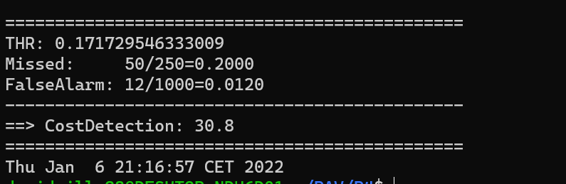

PAV - P4: reconocimiento y verificación del locutor
===================================================

Obtenga su copia del repositorio de la práctica accediendo a [Práctica 4](https://github.com/albino-pav/P4)
y pulsando sobre el botón `Fork` situado en la esquina superior derecha. A continuación, siga las
instrucciones de la [Práctica 2](https://github.com/albino-pav/P2) para crear una rama con el apellido de
los integrantes del grupo de prácticas, dar de alta al resto de integrantes como colaboradores del proyecto
y crear la copias locales del repositorio.

También debe descomprimir, en el directorio `PAV/P4`, el fichero [db_8mu.tgz](https://atenea.upc.edu/pluginfile.php/3145524/mod_assign/introattachment/0/spk_8mu.tgz?forcedownload=1)
con la base de datos oral que se utilizará en la parte experimental de la práctica.

Como entrega deberá realizar un *pull request* con el contenido de su copia del repositorio. Recuerde
que los ficheros entregados deberán estar en condiciones de ser ejecutados con sólo ejecutar:

~~~~~~~~~~~~~~~~~~~~~~~~~~~~~~~~~~~~~~~~~~~~~~~~~~~~~.sh
  make release
  run_spkid mfcc train test classerr verify verifyerr
~~~~~~~~~~~~~~~~~~~~~~~~~~~~~~~~~~~~~~~~~~~~~~~~~~~~~

Recuerde que, además de los trabajos indicados en esta parte básica, también deberá realizar un proyecto
de ampliación, del cual deberá subir una memoria explicativa a Atenea y los ficheros correspondientes al
repositorio de la práctica.

A modo de memoria de la parte básica, complete, en este mismo documento y usando el formato *markdown*, los
ejercicios indicados.

## Ejercicios.

### SPTK, Sox y los scripts de extracción de características.

- Analice el script `wav2lp.sh` y explique la misión de los distintos comandos involucrados en el *pipeline*
  principal (`sox`, `$X2X`, `$FRAME`, `$WINDOW` y `$LPC`). Explique el significado de cada una de las 
  opciones empleadas y de sus valores.

  - `sox`: Incluye una serie de herramientas para tratar y convertir el señal de entrada a otro formato concreto indicado. Los parámetros empleados son: 

    - -t: Indica el formato, para nosotros raw.
    - -e: Indica el tipo de encoding que queremos, signed-integer en nuestro caso.
    - -b: Indica el sample size de la codificación, 16 bits en nuestro caso.
    
    El comando final usado es el siguiente: sox $inputfile -t raw -e signed -b 16

  - `$X2X`: Es un comando que forma parte de SPTK que convierte data de un formato a otro. En nuestro caso queremos convertir de short (2 bytes) a float (4 bytes), por lo que lo hemos usado del siguiente: 
    ```zsh
    $X2X +sf
    ```
  
  - `$FRAME`: Forma parte también de SPTK. Nos divide la señal de entrada en tramas de duración l y periodo p. Queremos una duración de 240 muestras con periodo de 80, por lo que lo hemos usado de la siguiente manera:
    ```zsh
    $FRAME -l 240 -p 80
    ```

  - `$WINDOW`: Forma parte de SPTK. Multiplica elemento por elemento del señal de entrada de duración l por una ventana determinada w, dando como resultado una trama de duración L. En nuestro hemos usado l=L=240 muestras y hemos dejado por defecto el valor de la ventana a usar (w=0, ventana Blackman). El comando final usado es el siguiente:
    ```zsh
    $WINDOW -l 240 -L 240
    ```
  - `$LPC`: Forma parte de SPTK. Calcula los LPC de orden m de las l muestras del señal de entrada. En nuestro caso hemos usado una duración de entrada de 240 muestras y el número de coeficientes indicado. Para acabar guardamos los coeficientes en `base.lp`. El comando usado es el siguiente:
    ```zsh
    $LPC -l 240 -m $lpc_order > $base.lp
    ```


- Explique el procedimiento seguido para obtener un fichero de formato *fmatrix* a partir de los ficheros de
  salida de SPTK (líneas 45 a 47 del script `wav2lp.sh`).
  
  Como hemos visto en la descripción de los comandos anterior, tenemos en `base.lp` los coeficientes LPC de la señal de entrada. Ahora queremos tener un fichero de formato fmatrix en el que tengamos la información solicitada de la señal en forma matricial. Para ello debemos indicar el número de columnas, que será el número de coeficientes LPC + 1, ya que en la primera posición tenemos guardada la ganancia de predicción, y el número de filas, igual al número de tramas de la señal. 

  ```zsh
  ncol=$((lpc_order+1)) #lpc p =>  (gain a1 a2 ... ap) 
  nrow=`$X2X +fa < $base.lp | wc -l | perl -ne 'print $_/'$ncol', "\n";'`
  ````

  El procedimiento seguido para determinar nrow es el siguiente:
    - Primero pasamos los datos de la señal obtenida en base.lp de formato float (f) a texto (a, ASCII).
    - Luego contamos el número de lineas de este archivo de texto con el comando wc -l para determinar el valor de nrow.

  * ¿Por qué es conveniente usar este formato (u otro parecido)? Tenga en cuenta cuál es el formato de
    entrada y cuál es el de resultado.

    Porque podemos visualizar de forma clara y ordenada con las funciones fmatrix los valores de los coeficientes en las que cada fila corresponde una trama de la señal. 

- Escriba el *pipeline* principal usado para calcular los coeficientes cepstrales de predicción lineal
  (LPCC) en su fichero <code>scripts/wav2lpcc.sh</code>:

  ```zsh
  sox $inputfile -t raw -e signed -b 16 - | $X2X +sf | $FRAME -l 240 -p 80 | $WINDOW -l 240 -L 240 |
	$LPC -l 240 -m $lpc_order | $LPC2C -m $lpc_order -M $cepstrum_order > $base.lpcc
  ```

- Escriba el *pipeline* principal usado para calcular los coeficientes cepstrales en escala Mel (MFCC) en su
  fichero <code>scripts/wav2mfcc.sh</code>:

  ```zsh
  sox $inputfile -t raw -e signed -b 16 - | $X2X +sf | $FRAME -l 240 -p 80 | $WINDOW -l 240 -L 240 |
	$MFCC -l 240 -m $mfcc_order -w 1 -n 26 -s 8 > $base.mfcc
  ```

### Extracción de características.

- Inserte una imagen mostrando la dependencia entre los coeficientes 2 y 3 de las tres parametrizaciones
  para todas las señales de un locutor.
  
  + Indique **todas** las órdenes necesarias para obtener las gráficas a partir de las señales 
    parametrizadas.

    *Parametrización LP*
      ~~~
        fmatrix_show work/lp/BLOCK01/SES017/*.lp | egrep '^\[' | cut -f4,5 > lpCoef2_3.txt
      ~~~
    *Parametrización LPCC*
    ~~~
      fmatrix_show work/lpcc/BLOCK01/SES017/*.lpcc | egrep '^\[' | cut -f4,5 > lpccCoef2_3.txt
    ~~~
    *Parametrización MFCC*
    ~~~
      fmatrix_show work/mfcc/BLOCK01/SES017/*.mfcc | egrep '^\[' | cut -f4,5 > mfccCoef2_3.txt
    ~~~

    ```python
    import numpy as np
    import matplotlib.pyplot as plt
    import os

    ARCHIVOS_FOLDER = os.path.join(os.getcwd(), "Archivos")

    plt.figure(figsize=(30, 18), dpi=80)
    i = 311

    for file in sorted(os.listdir(ARCHIVOS_FOLDER)):                                        
      if file.endswith(".txt"):
        plt.subplot(i)
        file_dir = os.path.join(ARCHIVOS_FOLDER, file)
        data = np.loadtxt(file_dir)
        plt.scatter(data[:,0], data[:,1], s=0.5, color = 'blue')
        plt.xlabel(file[:-8])
        plt.grid()
        i += 1

    plt.savefig("grafica.png") 
    plt.show()
    ```
  + ¿Cuál de ellas le parece que contiene más información?

  

  Respecto a las diferentes parametrizaciones con las que hemos trabajado, cuando buscamos la que "contiene más información" nos referimos a la incorrelación entre sus coeficientes. 
  Una manera fácil y gráfica de observar la incorrelación es con las gráficas de las diferentes parametrizaciones.
  En el caso de LP obtenemos una distribución con comportamiento prácticamente lineal y con una menor dispersión que en las otras parametrizaciones. 
  Por ejemplo en el caso de la parametrización LPCC observamos una distribución más dispersa, factor que implica una mayor incorrelación entre coeficientes por consiguiente, contiene más información.
  Finalmente para la parametrización MFCC observamos que es la que presenta mayor incorrelación, así que podemos decir, que será la parametrización que contenga más información de las 3.

- Usando el programa <code>pearson</code>, obtenga los coeficientes de correlación normalizada entre los
  parámetros 2 y 3 para un locutor, y rellene la tabla siguiente con los valores obtenidos.

  |                        | LP   | LPCC | MFCC |
  |------------------------|:----:|:----:|:----:|
  | &rho;<sub>x</sub>[2,3] |-0.695|0.2391|0.7168|
  
  + Compare los resultados de <code>pearson</code> con los obtenidos gráficamente.

  Una vez obtenidos los resultados de los coeficientes de la correlaciones, podemos afirmar que son los esperados en relación a las gráficas previamente observadas. Por ejemplo, en el caso de la parametrización LP observamos que aporta poca información mientras que la LPCC es la que más información transmite.
  
- Según la teoría, ¿qué parámetros considera adecuados para el cálculo de los coeficientes LPCC y MFCC?

Como hemos visto en el apartado de teoría ,   para la parametrización MFCC un orden de 30 coeficientes es suficiente y en el caso del filtro de 24-40. Para la parametrización LPCC, hemos usado un orden de 25 coeficientes tal como indica la librería SPTK ya que nos proporciona un buen resultado.

### Entrenamiento y visualización de los GMM.

Complete el código necesario para entrenar modelos GMM.

- Inserte una gráfica que muestre la función de densidad de probabilidad modelada por el GMM de un locutor
  para sus dos primeros coeficientes de MFCC.

  Por ejemplo en el caso del locutor SES008, hemos ejecutado el siguiente código para obtener la gráfica:
  ```zsh
  plot_gmm_feat -x1 -y2 -p 99,90,50,10 work/gmm/mfcc/SES008.gmm work/mfcc/BLOCK00/SES008/SA008S*
  ```

  


- Inserte una gráfica que permita comparar los modelos y poblaciones de dos locutores distintos (la gŕafica
  de la página 20 del enunciado puede servirle de referencia del resultado deseado). Analice la capacidad
  del modelado GMM para diferenciar las señales de uno y otro.

  En la siguiente imagen se puede comparar el locutor SES008 con SES002

    

### Reconocimiento del locutor.

Complete el código necesario para realizar reconociminto del locutor y optimice sus parámetros.

- Inserte una tabla con la tasa de error obtenida en el reconocimiento de los locutores de la base de datos
  SPEECON usando su mejor sistema de reconocimiento para los parámetros LP, LPCC y MFCC.

  ###### LP  
  
  ###### LPCC
  
  ###### MFCC
  

  |                        | LP   | LPCC | MFCC |
  |------------------------|:----:|:----:|:----:|
  | Tasa de error          |12.23%|2.68 %|1.02 %|


### Verificación del locutor.

Complete el código necesario para realizar verificación del locutor y optimice sus parámetros.

- Inserte una tabla con el *score* obtenido con su mejor sistema de verificación del locutor en la tarea
  de verificación de SPEECON. La tabla debe incluir el umbral óptimo, el número de falsas alarmas y de
  pérdidas, y el score obtenido usando la parametrización que mejor resultado le hubiera dado en la tarea
  de reconocimiento.

  ###### LP  
  
  ###### LPCC
  
  ###### MFCC
  

  |                        | LP   | LPCC | MFCC |
  |------------------------|:----:|:----:|:----:|
  | THR;                   |   0.245225328848207   |   0.171729546333009   |   0.318468713031995   |
  | Missed;                |   70/250=0.2800   |   50/250=0.2000  |   19/250=0.0760   |
  | False Alarm;           |   23/1000=0.0230  |   12/1000=0.0120   |   2/1000=0.0020   |
  | Cost Detection;        |   48.7   |   30.8   |   9.4   |

 
### Test final

- Adjunte, en el repositorio de la práctica, los ficheros `class_test.log` y `verif_test.log` 
  correspondientes a la evaluación *ciega* final.

### Trabajo de ampliación.

- Recuerde enviar a Atenea un fichero en formato zip o tgz con la memoria (en formato PDF) con el trabajo 
  realizado como ampliación, así como los ficheros `class_ampl.log` y/o `verif_ampl.log`, obtenidos como 
  resultado del mismo.
